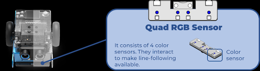

## 🏁 F. Seguimiento de Línea (Conceptos Básicos)

El sensor del mBot2 detecta cuánta luz rebota del suelo. Para ello, utiliza el Sensor Quad RGB, que en realidad son 4 sensores en fila situados debajo del robot.



### ¿Qué significan L1, R1, L2 y R2?

Estos nombres indican la posición de cada sensor desde la perspectiva del robot:

- L2 (Left 2): El sensor en el extremo izquierdo.
- L1 (Left 1): El sensor central izquierdo.
- R1 (Right 1): El sensor central derecho.
- R2 (Right 2): El sensor en el extremo derecho.

El sensor del mBot2 detecta cuánta luz rebota del suelo.

- Línea Negra: Rebota poca luz (valor bajo, menos de 50%).
- Suelo Blanco: Rebota mucha luz (valor alto, más de 50%).

### 1. La Lógica de Decisión

Para que el robot siga la línea, debe decidir según lo que ven sus dos sensores centrales (L1 y R1):

- Si L1 y R1 ven negro: El robot está centrado → Avanza recto.
- Si solo L1 ve negro: El robot se está saliendo por la derecha → Gira a la izquierda.
- Si solo R1 ve negro: El robot se está saliendo por la izquierda → Gira a la derecha.

### 2. Código del Programa

Este es el programa completo y simplificado. Primero pruébalo solo con luces; cuando funcione, quita el símbolo # de los motores.

```python
import cyberpi as cpi

# BUCLE PRINCIPAL
while True:
    # Leer valores de los sensores de línea
    # L1 y R1 son los sensores internos
    L1 = cpi.quad_rgb_sensor.get_gray('L1')
    R1 = cpi.quad_rgb_sensor.get_gray('R1')

    if L1 < 50 and R1 < 50:
        # AMBOS EN NEGRO: Recto
        cpi.mbot2.drive_power(20, -20)
        cpi.led.on('red', id=2) # Luz izquierda
        cpi.led.on('red', id=4) # Luz derecha

    elif L1 < 50:
        # SOLO IZQUIERDA EN NEGRO: Girar a la izquierda
        cpi.mbot2.drive_power(5, -20)
        cpi.led.on('red', id=2)
        cpi.led.off(id=4)

    elif R1 < 50:
        # SOLO DERECHA EN NEGRO: Girar a la derecha
        cpi.mbot2.drive_power(20, -5)
        cpi.led.on('red', id=4)
        cpi.led.off(id=2)

    else:
        # FUERA DE LA LÍNEA (Blanco): Luces verdes
        cpi.led.on('green')
```

Para seguir la línea más rápido, es posible que necesites cambiar:

- La potencia de las ruedas izquierda y derecha.
- La diferencia de potencia entre la rueda izquierda y la derecha.
- Cómo interpretas los valores porcentuales del sensor de color.
- El uso de los sensores L2 y R2 también.
